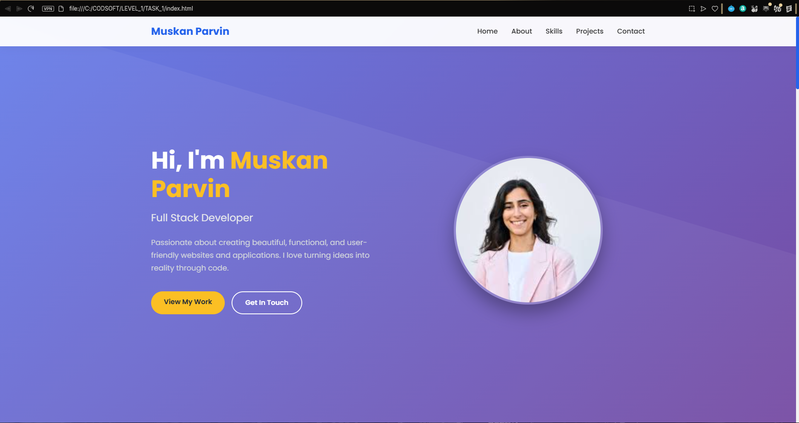
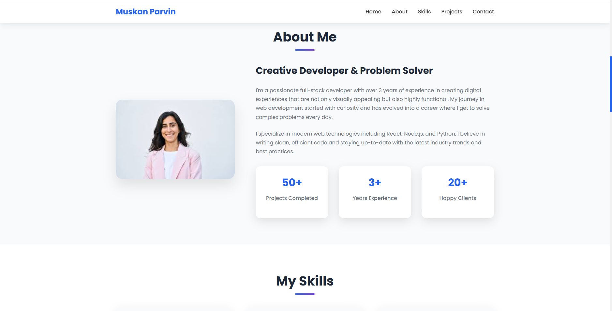
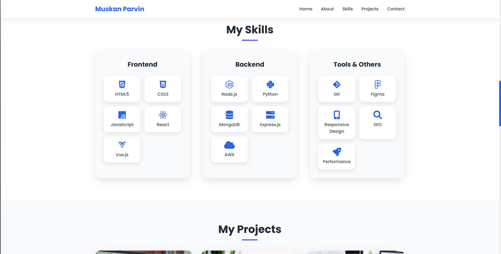
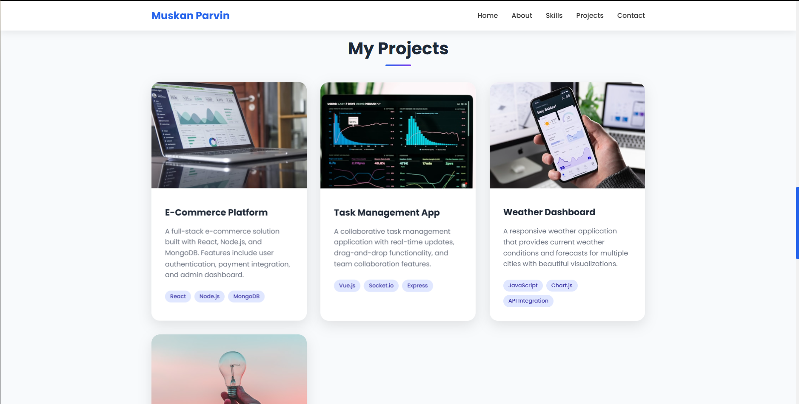
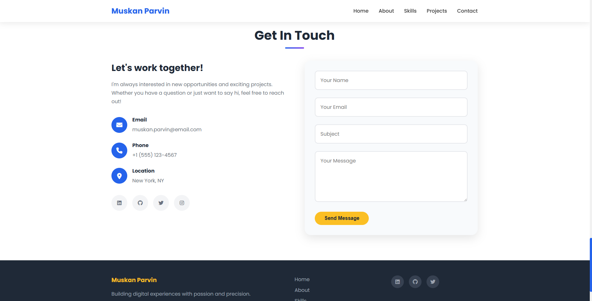

# Muskan Parvin - Personal Portfolio Website

A modern, responsive personal portfolio website built with HTML, CSS, and JavaScript. This project showcases a clean, professional design with smooth animations and interactive features.



## 🌟 Features

### Design & User Experience
- **Modern Design**: Clean, professional layout with beautiful gradients and animations
- **Fully Responsive**: Optimized for all devices (desktop, tablet, mobile)
- **Smooth Animations**: CSS animations and JavaScript interactions
- **Interactive Elements**: Hover effects, smooth scrolling, and dynamic content
- **Professional Typography**: Google Fonts (Poppins) for clean readability

### Sections Included
- **Header/Navigation**: Fixed navigation with smooth scrolling to sections
- **Hero Section**: Eye-catching introduction with animated text
- **About Section**: Personal bio with statistics and profile image
- **Skills Section**: Organized showcase of technical skills with icons
- **Projects Section**: Portfolio gallery with project details and links
- **Resume Section**: Download link for PDF resume
- **Contact Section**: Contact form and social media links
- **Footer**: Copyright and additional navigation

### Technical Features
- **Smooth Scrolling Navigation**: Jump to any section seamlessly
- **Mobile Menu**: Hamburger menu for mobile devices
- **Form Validation**: Contact form with email validation
- **Scroll Animations**: Elements animate into view on scroll
- **Typing Effect**: Dynamic subtitle animation in hero section
- **Parallax Effects**: Subtle background animations
- **Cross-browser Compatibility**: Works on all modern browsers

## 📸 Screenshots

### Desktop View

*Hero section with navigation and introduction*


*About section with bio and statistics*


*Skills section showcasing technical abilities*


*Projects gallery with hover effects*


*Contact section with form and information*

## 🚀 Technologies Used

- **HTML5**: Semantic markup and structure
- **CSS3**: Modern styling with Flexbox and Grid
- **JavaScript**: Interactive functionality and animations
- **Font Awesome**: Icons for enhanced visual appeal
- **Google Fonts**: Custom typography (Poppins)

## 📁 Project Structure

```
TASK_1/
│
├── index.html          # Main HTML file
├── styles.css          # CSS styles and animations
├── script.js           # JavaScript functionality
├── README.md           # Project documentation
├── README_resume.txt   # Instructions for resume PDF
└── Screenshots/        # Screenshots folder (to be added)
    ├── portfolio-preview.png
    ├── desktop-home.png
    ├── desktop-about.png
    ├── desktop-skills.png
    ├── desktop-projects.png
    ├── desktop-contact.png
    ├── mobile-home.png
    ├── mobile-menu.png
    └── mobile-projects.png
```

## 🛠️ Setup Instructions

### 1. Clone or Download
Download the project files to your local machine.

### 2. Add Your Resume
- Create a PDF version of your resume
- Name it `resume.pdf`
- Place it in the same folder as `index.html`

### 3. Customize Content
Edit the `index.html` file to update:
- Personal information
- Skills and expertise
- Project details and links
- Contact information
- Social media links

### 4. Add Screenshots
- Create a `Screenshots` folder
- Add the screenshots as referenced in this README
- Take screenshots of different sections and responsive views

### 5. Deploy
Upload all files to your web hosting service or use GitHub Pages for free hosting.

## 📱 Responsive Breakpoints

- **Desktop**: 1200px and above
- **Tablet**: 768px - 1199px
- **Mobile**: Below 768px
- **Small Mobile**: Below 480px

## ✨ Key Features Breakdown

### Navigation
- Fixed header that stays visible while scrolling
- Active section highlighting
- Smooth scrolling to sections
- Mobile hamburger menu

### Hero Section
- Animated typing effect for job titles
- Call-to-action buttons
- Professional profile image
- Gradient background with subtle patterns

### About Section
- Professional bio and description
- Animated statistics counters
- Skills highlight
- Personal photo

### Skills Section
- Organized by categories (Frontend, Backend, Tools)
- Icon-based representation
- Hover animations
- Comprehensive skill coverage

### Projects Section
- Project cards with images
- Hover overlay with links
- Technology tags
- GitHub and live demo links

### Contact Section
- Working contact form with validation
- Social media integration
- Contact information display
- Professional email setup

## 🎨 Color Scheme

- **Primary Blue**: #2563eb
- **Secondary Purple**: #7c3aed
- **Accent Yellow**: #fbbf24
- **Dark Gray**: #1f2937
- **Light Gray**: #f8fafc
- **Text Gray**: #6b7280

## 🌐 Browser Support

- Chrome (latest)
- Firefox (latest)
- Safari (latest)
- Edge (latest)
- Internet Explorer 11+

## 📋 Customization Guide

### Changing Colors
Edit the CSS variables in `styles.css`:
```css
:root {
  --primary-color: #2563eb;
  --secondary-color: #7c3aed;
  --accent-color: #fbbf24;
}
```

### Adding New Sections
1. Add HTML structure in `index.html`
2. Add corresponding CSS styles in `styles.css`
3. Update navigation menu if needed
4. Add JavaScript functionality if required

### Modifying Animations
Animation settings can be found in `styles.css` under:
- `@keyframes` definitions
- `.animate` classes
- Transition properties

## 🔧 Performance Optimization

- **Optimized Images**: Using appropriate image sizes and formats
- **Minified Code**: CSS and JavaScript can be minified for production
- **Font Loading**: Optimized Google Fonts loading
- **Smooth Animations**: Hardware-accelerated CSS animations
- **Lazy Loading**: Images load as needed

## 📞 Support & Contact

For questions about this portfolio template:
- **Email**: muskan.parvin@email.com
- **GitHub**: [Your GitHub Profile]
- **LinkedIn**: [Your LinkedIn Profile]

## 📝 License

This project is open source and available under the [MIT License](LICENSE).

## 🙏 Acknowledgments

- **Font Awesome**: For beautiful icons
- **Google Fonts**: For typography
- **Unsplash**: For placeholder images
- **CSS Tricks**: For inspiration and techniques

---

**Built with ❤️ by Muskan Parvin** | © 2025 All Rights Reserved

## 📈 Future Enhancements

- [ ] Add blog section
- [ ] Implement dark mode toggle
- [ ] Add more project filtering options
- [ ] Include testimonials section
- [ ] Add loading animations
- [ ] Implement contact form backend
- [ ] Add more language support
- [ ] Include accessibility improvements
